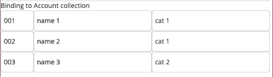
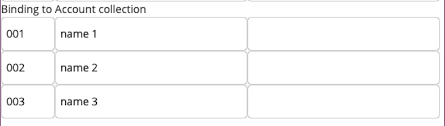
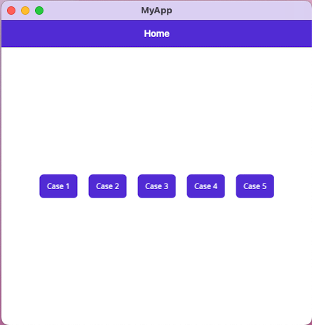
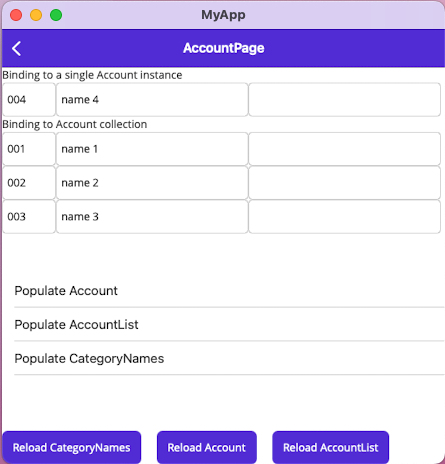
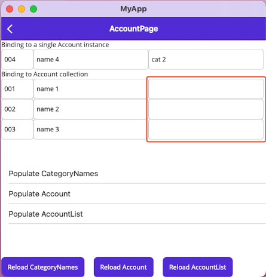
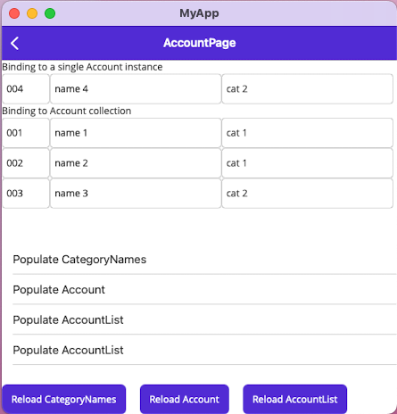

# MAUI Picker bug

When presenting a list of objects in a `CollectionView` with a `Picker` like so
```cs
public class AccountPageViewModel : ViewModelBase
{
    [Reactive] public ObservableCollection<Account> AccountList { get; set; }
    [Reactive] public ObservableCollection<string> CategoryNames { get; set; }

    protected override async Task OnInitializeAsync( CancellationToken cancellationToken )
    {
        await base.OnInitializeAsync( cancellationToken );

        await PopulateAccountAsync();
        await PopulateAccountListAsync();
        await PopulateCategoryNamesAsync();
    }

    protected Task PopulateCategoryNamesAsync()
    {
        Protocol.Add( "Populate CategoryNames" );
        CategoryNames = new ObservableCollection<string>(
            new[]
            {
                "cat 1",
                "cat 2",
                "cat 3",
            } );
        return Task.CompletedTask;
    }

    protected Task PopulateAccountListAsync()
    {
        Protocol.Add( "Populate AccountList" );
        AccountList = new ObservableCollection<Account>(
            new[]
            {
                new Account { CategoryName = "cat 1", Name = "name 1", Number = "001", },
                new Account { CategoryName = "cat 1", Name = "name 2", Number = "002", },
                new Account { CategoryName = "cat 2", Name = "name 3", Number = "003", },
            } );
        return Task.CompletedTask;
    }
}
```
```xml
<CollectionView ItemsSource="{Binding AccountList}">
    <CollectionView.ItemTemplate>
        <DataTemplate x:DataType="{x:Type models:Account}">
            <Grid ColumnDefinitions="70,250,250,250">

                <Entry Text="{Binding Number}"
                        Grid.Column="0"/>

                <Entry Text="{Binding Name}"
                        Grid.Column="1"/>

                <Picker ItemsSource="{Binding Source={RelativeSource AncestorType={x:Type ContentPage}}, Path=BindingContext.CategoryNames}"
                        SelectedItem="{Binding CategoryName}"
                        Grid.Column="2"/>
            </Grid>
        </DataTemplate>
    </CollectionView.ItemTemplate>
</CollectionView>
```

I expect to get something like



but instead the `Picker` does not show any content.



## Steps to reproduce

- Compile and run `MyApp/MyApp.csproj`

  

- Click on `Case 1`

  

- Click on `Reload Account`

  

- Click on `Reload AccountList`

  

## Workaround or "My Little Messie"

The `Case 5` does some weird initialization like

```cs
protected override async Task OnInitializeAsync( CancellationToken cancellationToken )
{
    await base.OnInitializeAsync( cancellationToken );

    await PopulateCategoryNamesAsync();
    await Task.Delay( 20 );
    await PopulateAccountListAsync();
    await Task.Delay( 20 );
    await PopulateAccountListAsync();
    await Task.Delay( 20 );
}
```

which does lead to the result I would have expected from any case:

